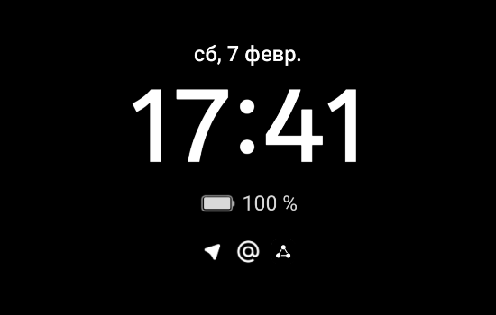

# OxygenOS Material Icons — LSPosed Module

## Что делает модуль

Восстанавливает стандартное поведение Material-иконок уведомлений на OxygenOS 16.

**Проблема:** OxygenOS заменяет оригинальные монохромные small icons на цветные иконки приложений:
- в статус-баре — цветные иконки вместо тинтуемых монохромных;
- на AOD (Always-On Display) — цветные иконки вместо белых силуэтов.

**Решение модуля:**
- **Статус-бар** — монохромные small icons (автоматически светлые/тёмные в зависимости от фона экрана);
- **Шторка уведомлений** — цветные иконки приложений (как в стандартном Android);
- **AOD (Always-On Display)** — монохромные белые силуэты.

### Скриншоты

---

## Как работает модуль

### Архитектура

1. **Framework (процесс `android`):** блокирует замену small icon OxygenOS.
2. **SystemUI:** перехватывает выбор иконки для статус-бара, шторки и AOD-элементов.
3. **AOD Engine (VariUIEngine):** загружается как плагин внутри SystemUI; модуль хукает его классы и заменяет цветные иконки на монохромные.

### Ключевые идеи

- **OplusNotificationFixHelper.fixSmallIcon** — OxygenOS заменяет оригинальный `notification.smallIcon` на цветную app icon. Модуль блокирует этот метод, чтобы сохранить `TYPE_RESOURCE` Icon.
- **OxygenOS тематирует ресурсы:** при загрузке через `Icon.loadDrawable(context)` иконка батареи и др. становятся цветными bitmap. Модуль загружает ресурс без темы (`resources.getDrawable(resId, null)`) для получения оригинального монохромного VectorDrawable.
- **AOD Ramless:** при `aod_ramless_support = true` движок AOD использует `EgCommonHelper.getApplicationIcon()` (цветную иконку) вместо small icon. Модуль возвращает `hasFeature("oplus.software.display.aod_ramless_support") = false`, чтобы движок шёл по ветке с small icon.
- **iconCache:** хуки на `StatusBarNotification.getNotification()` и `getPackageName()` кэшируют `notification.smallIcon` по package name. Кэш используется в AOD engine и при конвертации иконок.

### Преобразование в монохром

Для иконок, которые не удаётся загрузить без темы (или при TYPE_BITMAP), модуль конвертирует drawable в монохром:

- `toWhiteAlphaMask` — для прозрачных иконок: сохраняет alpha, заменяет цвет на белый.
- `toForegroundSilhouette` — для непрозрачных: определяет фон по краям, извлекает силуэт по контрасту.
- `toLuminanceAlpha` — fallback для однотонных иконок: luminance → alpha.
- `ensureMonochrome` — выбирает подходящий метод, поддерживает `AdaptiveIconDrawable`, `getMonochrome()` (API 33+).

---

## Хукаемые классы и методы

### initZygote (хуки наследуются всеми процессами)

| Класс | Метод | Действие |
|-------|-------|----------|
| `com.oplus.content.OplusFeatureConfigManager` | `hasFeature(String)` | Для `oplus.software.display.aod_ramless_support` возвращает `false` |
| `android.service.notification.StatusBarNotification` | `getNotification()` | Кэширует `notification.smallIcon` в `iconCache[pkg]` |
| `android.service.notification.StatusBarNotification` | `getPackageName()` | При отсутствии в кэше — заполняет `iconCache[pkg]` |
| `android.app.ApplicationPackageManager` | `getApplicationIcon` | В процессе AOD: подменяет на small icon из кэша или монохром из app icon |
| `android.app.Notification` | `getLargeIcon()` | В процессе AOD: возвращает `smallIcon` вместо large icon |
| `dalvik.system.DexClassLoader` / `BaseDexClassLoader` | конструктор | При `dexPath` содержащем `"uiengine"` — хукает классы AOD engine |

### handleLoadPackage

| Пакет | Хук | Действие |
|-------|-----|----------|
| `android` | `OplusNotificationFixHelper.fixSmallIcon` | `beforeHookedMethod` → `param.result = notif` (блокирует замену) |
| `com.android.systemui` | `IconManager.getIconDescriptor(NotificationEntry, boolean)` | `allowConversationGroup=false` → статус-бар: тинтуемая иконка; `true` → шторка: app icon |
| `com.android.systemui` | `OplusNotificationHeaderViewWrapperExImp.proxyOnContentUpdated` | Устанавливает app icon на `mIcon` в header |
| `com.android.systemui` | `NotificationHeaderViewWrapper.onContentUpdated`, `resolveHeaderViews` | То же |
| `com.android.systemui` | `NotificationLayout.updateNotificationView(SBN)` | Заменяет иконку на монохром small icon |
| `com.android.systemui` | `OplusAodCurvedDisplayView.updateReceiveNotification(SBN)` | Заменяет `mIncomingNotiPaint.mDrawable` на монохром |
| `com.oplus.aod` | `OplusFeatureConfigManager.hasFeature` | Backup: `aod_ramless_support` → `false` |
| `com.oplus.aod` | `UIEngineManager.init(Context)` | Backup: получает `engineClassLoader`, хукает engine |

### AOD Engine (VariUIEngine.apk, classloader с "uiengine" в dexPath)

| Класс | Метод | Действие |
|-------|-------|----------|
| `com.oplus.egview.widget.NotificationView` | `updateNotificationIconData(String[], Drawable[])` | **Главный хук.** Заменяет каждый drawable на монохром small icon из `iconCache` (приоритет: загрузка без темы, затем с темой + ensureMonochrome) |
| `com.oplus.egview.widget.NotificationView` | `getPackageDrawable(List, String, SBN)` | Возвращает монохром small icon вместо app icon |
| `com.oplus.egview.util.EgCommonHelper` | `getApplicationIcon(Context, String)` | Возвращает small icon из кэша или монохром из app icon |
| `com.oplus.egview.glide.GlideLoaderKt` | `loadGeneric(String, ImageView, ...)` | Для package name — ставит small icon из кэша |

---

## LSPosed Scope

- `android` — Framework (OplusNotificationFixHelper, OplusFeatureConfigManager)
- `com.android.systemui` — SystemUI (IconManager, шторка, AOD Layout/CurvedDisplay, DexClassLoader для VariUIEngine)
- `com.oplus.aod` — Backup (на OxygenOS 16 AOD — плагин в SystemUI, отдельный процесс может не существовать)

---

## Требования

- OxygenOS 16 (протестировано на OnePlus)
- LSPosed или ReLSPosed
- Xposed API 93+

---

## Назначение проекта

Модуль LSPosed/Xposed для OxygenOS 16, который восстанавливает Material-стиль иконок уведомлений:
- статус-бар: монохромные small icons с авто-тинтом;
- шторка: цветные app icons;
- AOD: монохромные белые силуэты.

## Контекст для правок

1. **Пользователь сообщает о проблеме с иконками**
   - Понять: статус-бар, шторка или AOD.
   - Учесть: OxygenOS может менять пути загрузки иконок и классы. Нужно смотреть `HookEntry.kt` и при необходимости добавлять/менять хуки.
   - Типичные причины: смена пакетов/классов в обновлении OxygenOS, новые пути загрузки AOD.

2. **Добавление поддержки другой версии OxygenOS**
   - Сравнить имена пакетов и классов (OplusNotificationFixHelper, IconManager, NotificationView и т.д.) с текущими.
   - Добавить fallback-хуки для альтернативных классов/методов.
   - Сохранить блокировку `fixSmallIcon` и приоритет small icon над app icon.

3. **Изменение поведения иконок**
   - Статус-бар: `IconManager.getIconDescriptor` при `allowConversationGroup=false`.
   - Шторка: тот же метод при `true` + `hookShadeForColoredIcons`.
   - AOD: `NotificationView.updateNotificationIconData` — основной путь; `getPackageDrawable`, `EgCommonHelper.getApplicationIcon`, `GlideLoaderKt.loadGeneric` — резервные пути.

4. **Белые квадраты / артефакты на AOD**
   - Иконка может заполнять почти весь канвас → `toWhiteAlphaMask` даёт белый прямоугольник.
   - Логика в `ensureMonochrome`: если `isBadSilhouette` — пробовать `toForegroundSilhouette`, `toLuminanceAlpha`.
   - Приоритет: загрузка ресурса без темы (`loadIconWithoutTheme`) для TYPE_RESOURCE.

5. **Цветные иконки в статус-баре**
   - OxygenOS может подменять small icon до хука. Проверить, что `fixSmallIcon` блокируется.
   - TYPE_RESOURCE загружается с темой в цветной bitmap → использовать `loadIconWithoutTheme` и проверку `isColoredIcon`.
   - При необходимости конвертировать в монохром bitmap.

6. **Не тинтуются на светлом фоне**
   - TYPE_RESOURCE иконки тинтуются системой. TYPE_BITMAP — нет.
   - Предпочтительно оставлять TYPE_RESOURCE (через `notification.icon` resId, если small icon уже TYPE_BITMAP).

## Важные функции

- `loadIconWithoutTheme(Icon, pkg, context)` — загрузка ресурса без OxygenOS-темы.
- `ensureMonochrome(Drawable)` — конвертация в белый силуэт (AdaptiveIcon, прозрачные/непрозрачные иконки).
- `iconCache` — ConcurrentHashMap<String, Icon>, заполняется в SBN-хуках, используется в AOD.
- `engineHooked` — AtomicBoolean, чтобы хукать AOD engine только один раз.